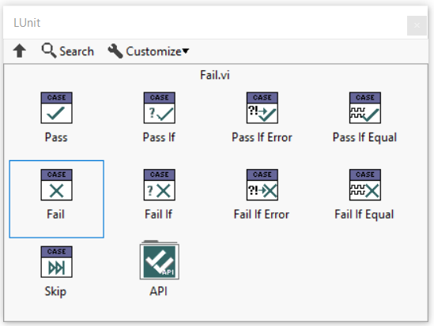

# Framework Architecture

The LUnit unit testing framework is derived from the xUnit architecture.
This page briefly introduces the main concepts.
The core was rewritten as of version 1.2 and the discussion below is accurate only for versions more recent than 1.2.

## General Architecture

The framework defines a Runnable interface, which, as the name, implies defines a class as runnable.
The base Test Case class implements the runnable interface and an execution of a test is done by instantiating an object of a Test Case class and running it.
To run more than one test, multiple instances of the Test Case class are instantiated.

Multiple tests may be aggregated into a Test Suite object, which also implements the Runnable interface, and may be executed by calling the Run VI on the Test Suite.
While a Test Case will always be done after one call to the Run VI, a Test Suite may require multiple calls before being done.
Test Suites may form composites (suites of suites), but this is not visible through the Runnable interface.

Test Suites are typically generated through test discovery using factory VIs located in the Test Suite class. 
These VI:s can generate test suites containing all tests in a specific class, library or project.

## Test Case

A Test Case is the base class containing all test methods which are included in the test case.
The Test Case class defines two dynamic dispatch test methods called Setup.vi and Teardown.vi.
These methods are executed before and after each test method in the test case.

## Test Methods

A test method is a VI belonging to a class inheriting from the Test Case class.
It is not recommended to make test methods have Dynamic Dispatch terminals.
As of version 1.8, it is not longer required for test method names to start with the letters `test`.
The connector pane of the test case must use the 4-2-2-4 pattern and have the standard connectors for static dispatch methods (the error input being optional as there will never be any upstreams errors coming into the test vi).

## Assertions

Tests are evaluated by one or more assertions called in the test method.
The assertions are available from the LUnit palette and the quick drop menu.
Assertions are evaluated when the test case executes and the result of the assertions are reported by the framework.
Multiple assertions may be used in a single test method and results from all assertions will be available in the test report.
A test case will fail if one or more of the assertions fail.
Likewise a test case will produce an error result if one or more of the assertions receives an error on the `Error In` terminal.

## Test Runner

A test runner is a process executing a Test Suite and collecting the results.
LUnit supports spawning multiple parallel test runners, which can significantly reduce the test time for large test suites.
Test runners may run in separate threads and can leverage a multithreaded processor to run tests concurrently.
When the Parallel Test Runner is enabled, tests are grouped into one suite for each Test Case class and all these are then executed in separate threads.

## Test Finder

When launching the LUnit UI, the test finder searches for classes inheriting from the base Test Class within the current application instance.
The result is saved into an index file and retrieved on subsequent runs to only search through classes which have changed since last time.
To force the test finder to recreate the index, use the refresh test index button in the LUnit UI.

## LabVIEW API

An API is provided for executing tests programmatically from LabVIEW.
The use of the API is illustrated in the `LUnit API Demo` example.

The API was simplified in version 1.2.6 and now only consists of one VI for running tests from a path.
The reason for this change is that the low level API, provided earlier, had some sensitivity to internal changes and made updates more difficult.

The low level API is still used by the high level API method and the low level VIs may be used to alter the behavior of the test execution.
Because of the low level nature, this API is more volatile and may break in later releases, while the high level method is very likely to remain stable.

## Low Level API

Before going on, see the warning in the previous section.
Now continue on your own risk.

The low level API may be use to run tests in various ways.
Tests are executed using the provided methods and results are returned using User Events, which may be registered for using the provided API method.
To use the API methods, an API reference must first be obtained using the `LUnit Open API Reference.vi`.
The configuration VI:s `LUnit Configure Reporting.vi` and `LUnit Configure Test Runner.vi`  should be used before executing a test.

A test case is executed by calling one of the Run Test API VI:s.
To observe the results of the test execution, the `LUnit Register for Events.vi` must be called before starting test execution.
Results are returned using a data object through the user event registration.

When the execution has completed a result with type `Test Run` is generated.
To abort a running test, use the `LUnit Abort.vi`.
When done, use the `LUnit Close API Reference.vi` and unregister for any event obtained from `LUnit Register for Events.vi`.

## Command Line Interface

LUnit exposes a command line interface (CLI) to [enable execution from continuous integration tools](../30_CI%20Integration/CI%20Integration.md).
LUnit adds an operation to the LabVIEWCLI when installed.
Please note that LUnit must be installed for the version of LabVIEW called from the CLI.
