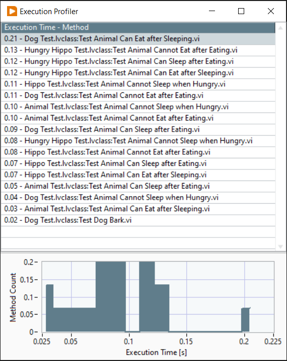
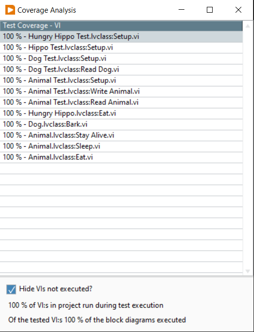

# Profiling Tools

LUnit has built in tools to help profile test suites.
These tools are meant to be used to identify issues and locate parts needing improvement, but should probably not be used as hard benchmarking tools.
The tools are enabled from the `Tools` menu of the LUnit User Interface and the results are displayed after test have been executed.

## Execution Profiler

The execution profiler is used to profile the time each test method takes to execute.
It is useful for identifying bottlenecks and improve the performance of a test suite.
Once activated, the following window is shown after each test execution.

In the table, the execution time for the test and the test name are shown, ordered by test time.
The histogram is useful to identify outliers and it is often these tests which have the biggest impact on the test execution time.

## Code Coverage Analyzer

The code coverage analyzer is useful for identifying parts of the code which has low test coverage.
The coverate is reported for each VI as a percentage indicating how much of the block diagram is exercised during test execution.

There are a few caveats to be aware of when using the coverage tool.

- The tool measures how many of the diagrams are executed in a VI as a percentage
- The reported coverage is zero for VIs which do not have debugging activated
- VIs in vi.lib are ignored
- Any VI with a name starting with `test` is ignored

Further, it is important to understand that the number obtained does not tell anything about the quality of the tests.
It only reveals how much of the code is exercised by the tests.
For a deeper discussion of the usefulness of the metric, please see [this](https://martinfowler.com/bliki/TestCoverage.html) blog post.
